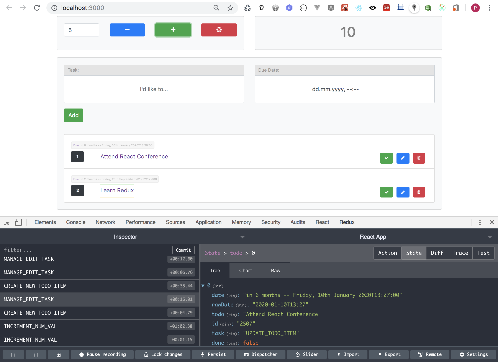

## React-Redux Example: 
##### A Numeric Counter + Todo Mini-App Combo

This Project demonstrates how to integrate Redux into a React Application.
This example is suited for any level of Javascript Programmer basically because it is simple and straightforward.
However, a knowledge of the basic concepts behind Redux is expected and thus assumed.

The App showcases 2 Components embedded in 1:
 1. A Numeric Counter that could count `Up` or `Down` by specific preset amount.
 2. A Todo Mini-App that manages To-Dos `sorts` them according to `Date` and `Status` (ie: if the Task has been `completed` or not)

